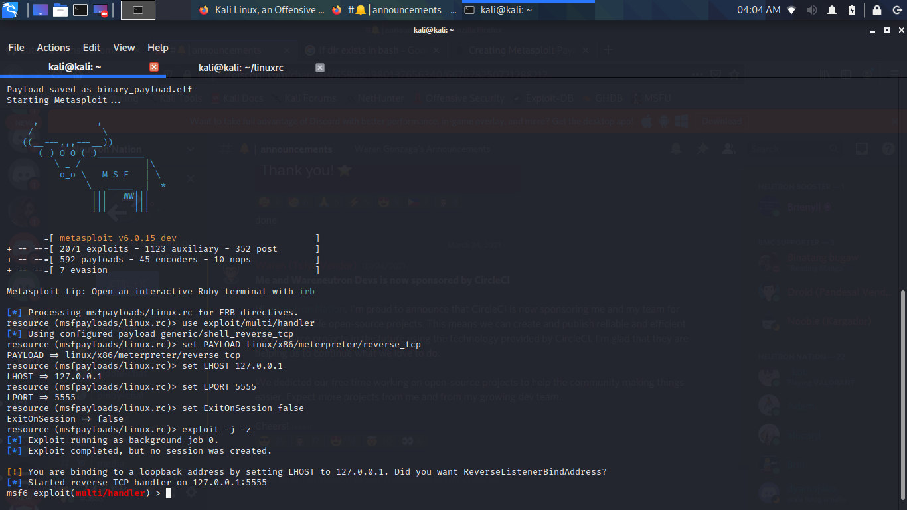

## 🟢 Auto-hack
Automation with bash scripts!
**Hacking has never been this easy!**

## 🩸 MsfVenom Auto starts Metasploit!

## What is a shell script?
>A shell script is a computer program designed to be run by the Unix shell, a command-line interpreter. The various dialects of shell scripts are considered to be >scripting languages. Typical operations performed by shell scripts include file manipulation, program execution, and printing text. 

## Why Use Bash Scripting?
Bash scripts can be used for various purposes, such as executing a shell command, running multiple commands together, customizing administrative tasks, performing task automation etc. So knowledge of bash programming basics is important for every Linux user.

## ⏲️ Real Hackers hack time!
>Hackers are also time hackers, we always need to remember that time is not on anyone's side but as long as you keep pp the pace with it then it will not be as cruel
to you.
